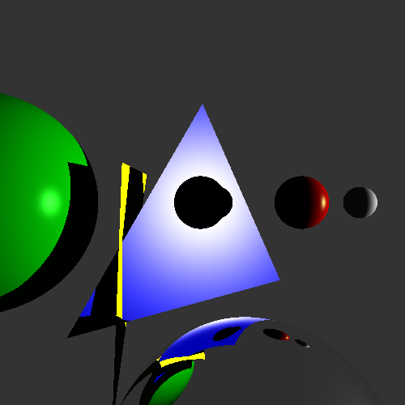

# Class Projects Repository
This repo has a lot of my projects from various classes. 

---

## Classes 
### **312 projects - Algorithms**

### **355 Projects - Image Processing**

### **455 Projects - Computer Graphics**

#### **Ray Tracing**
Developed a ray tracer capable of showcasing:
  - **Shadows**
  - **Specular highlights**
  - **Reflection**
  
#### **Ray Tracer Example Output**

#### **3D Rendering**
[`HousesRendering.py`](CS455/3DRendering/HousesRendering.py):
  - 3D renders a neighborhood in wireframe.
  - Includes a moving car to demonstrate animation.

#### **UE5 Gravit Video Game**
This project was created in **Unreal Engine 5** using Blueprints as part of my coursework. The gameplay includes:
- **Gravity Control**: Use the arrows to change gravity.
- **Platform Movement**: Activate platforms with designated buttons.
- **Double Jump**: Jump spheres grant a double jump ability.

The rock golem was created in **Maya**. Watch the gameplay demo below:

